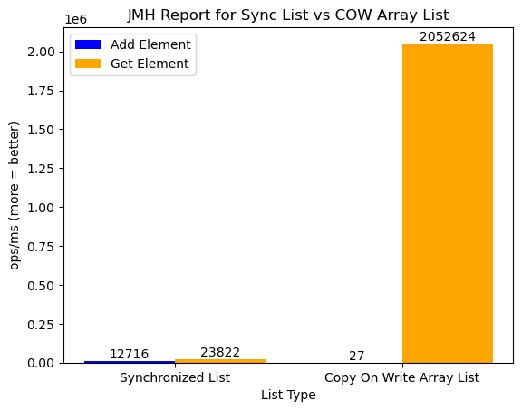

### Compare performance between Sync List and Copy On Write Array List

#### Plot visualization of results:

- Synchronized List JMH Results:

| Benchmark | Mode | Cnt | Score | Error | Units |
|-----------|------|-----|--------|--------|--------|
| SynchronizedListBenchmark.syncListGroup | thrpt | 25 | 36537.937 | ± 2454.152 | ops/ms |
| SynchronizedListBenchmark.syncListGroup:addElement | thrpt | 25 | 12715.674 | ± 1152.552 | ops/ms |
| SynchronizedListBenchmark.syncListGroup:getElement | thrpt | 25 | 23822.264 | ± 1719.763 | ops/ms |

- CopyOnWriteArrayList JMH Results:

| Benchmark | Mode | Cnt | Score | Error | Units |
|-----------|------|-----|--------|--------|--------|
| CopyOnWriteListBenchmark.copyOnWriteListGroup | thrpt | 25 | 2052650.563 | ± 38829.944 | ops/ms |
| CopyOnWriteListBenchmark.copyOnWriteListGroup:addElement | thrpt | 25 | 26.562 | ± 0.085 | ops/ms |
| CopyOnWriteListBenchmark.copyOnWriteListGroup:getElement | thrpt | 25 | 2052624.001 | ± 38829.927 | ops/ms |

